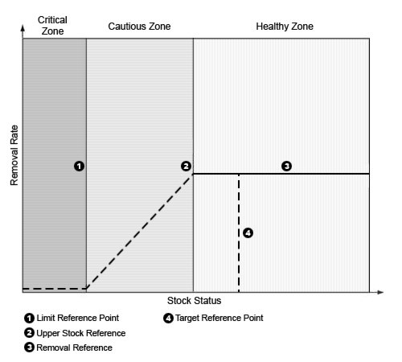

#FIGURES


```{r fig-pa, fig.cap="Illustration of DFO's PA Framework", out.width="5in"}


```

```{r fig-mse, fig.cap="PLACEHOLDER: Illustration of the MSE process", out.width="5in"}
knitr::include_graphics("figure/Fig2_MSE.png")

```


```{r fig-dlmtool, fig.cap="PLACEHOLDER: The steps of the MSE process following @punt2016 as implemented in DLMtool", out.width="5in"}
knitr::include_graphics("figure/Fig3_DLMtool_Steps.png")

```


